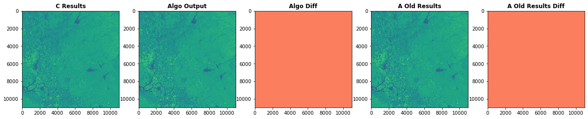

<div align="center">
    <h1>RasterPack</h1>
    <hr>
    A set of tools to designed to make processing raster data easier and faster
</div>



<p align="center">
    <a href="#key-features">Key Features</a> •
    <a href="#how-to-use">How to Use</a>
</p>

## Key Features

- Written in Python using [RasterIO](https://github.com/mapbox/rasterio) and [GDAL](https://gdal.org/) packages
- Import/read-in many different types of satellite/raster imagery
- Run pre-processing steps on imagery in a common way
    - Vegetation indices
    - Resampling
    - Rescaling
- Write out results to disk

*With many more features planned*

## How to Use

```bash
git clone https://github.com/adamweingram/RasterPack.git RasterPack

pip3 install -e ./RasterPack
```
